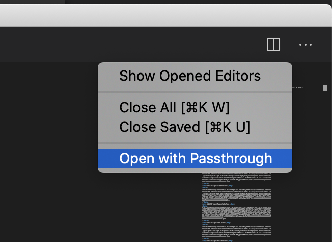

# fspassthrough README

This extension just implements a basic `FileSystemProvider` that passes through the normal filesystem. So if you open `passthrough:///path/to/file`, the provider simply returns `file:///path/to/file`.

## Usage

1. After installing the extensiono, open a file on the filesystem.
2. Go to the editor context menu, and click "Open with Passthrough":

3. A new tab opens the same file using `PassthroughFS`.
